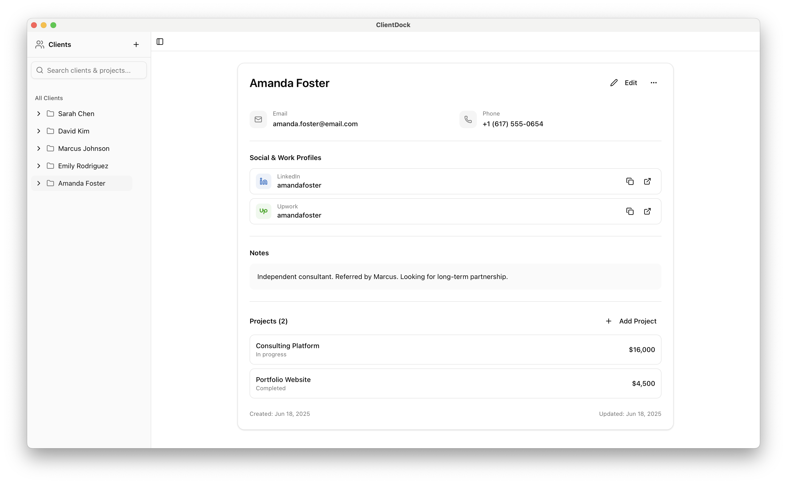
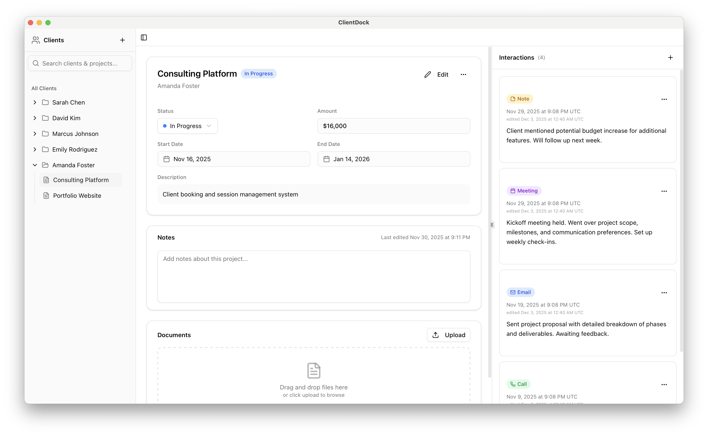
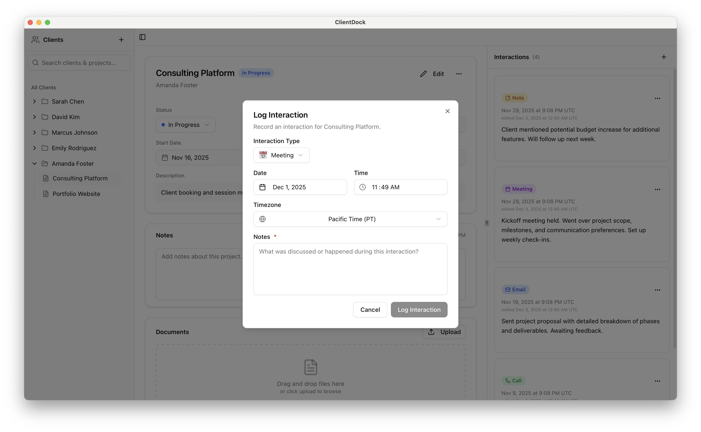
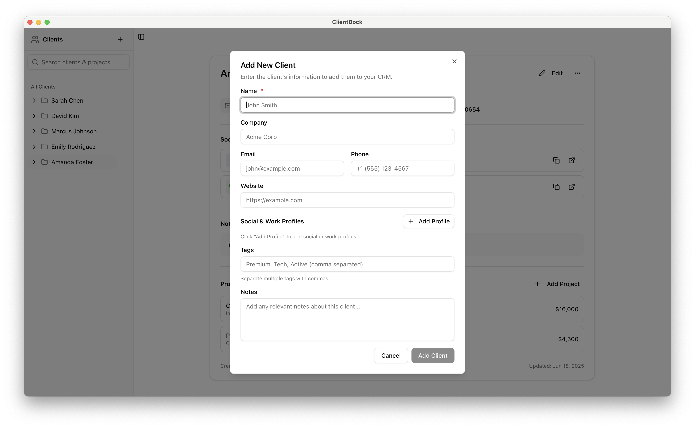

<p align="center">
  
</p>
<h1 align="center">ClientDock</h1>
<p align="center">
  <strong>A modern, local-first desktop CRM for freelancers and small businesses</strong>
</p>
<p align="center">
  <a href="../../releases/latest"></a>
  
  
</p>

---

## Overview

ClientDock is a privacy-focused desktop CRM that helps you manage your clients, projects, and interactions. All your data stays on your device, giving you complete control and privacy.

> **📢 Beta Notice:** ClientDock is currently in beta. Features and functionality are actively being refined based on user feedback.

---

## Quick Start

### Download & Install

Choose your platform and get started in minutes:

| Platform | Download |
|----------|----------|
| **Windows** | [Get Windows installer (.exe)](./releases/ClientDock_beta_windows_x64_setup.exe) |
| **macOS** | [Get macOS installer (.dmg)](./releases/ClientDock_beta_macos_aarch64.dmg) |
| **Linux** | [AppImage (.AppImage)](./releases/ClientDock_beta_aarch64.AppImage) / [Deb (.deb)](./releases/ClientDock_beta_arm64.deb) |

<details>
<summary><strong>Installation Instructions</strong></summary>

**Windows:**
1. Run the downloaded `.exe` installer
2. Follow the installation wizard
3. Launch ClientDock from the Start menu

**macOS:**
1. Open the `.dmg` file
2. Drag ClientDock to your Applications folder
3. Launch the app (if blocked by security, go to System Settings → Privacy & Security → Open Anyway)

**Linux:**

*AppImage:*
```bash
chmod +x ClientDock_beta_aarch64.AppImage
./ClientDock_beta_aarch64.AppImage
```

*Debian/Ubuntu:*
```bash
sudo dpkg -i ClientDock_beta_arm64.deb
```

</details>

---

## Core Features

**Client Management**  
Create detailed profiles for each client with contact information, notes, and custom fields.

**Project Tracking**  
Organize projects under clients, attach documents, and track project metadata.

**Interaction History**  
Log every meeting, call, email, and note in a chronological timeline for complete context.

**Local-First Architecture**  
Your data lives on your device. No cloud servers, no tracking, complete privacy.

**Clean Interface**  
Intuitive design that gets out of your way so you can focus on your work.

---

## Screenshots

Below are guided screenshots showing a typical workflow in ClientDock — from the main dashboard to creating clients and logging interactions. The images are ordered to follow a typical user flow.

- **01 — Client Profile:** Client details, contact methods, and custom fields.
- **02 — Project View:** Projects grouped under a client with metadata and documents.
- **03 — Interaction Timeline:** Chronological log of meetings, calls, and notes.
- **04 — Add Client Dialog:** The modal used to quickly add a new client.

<p align="center">
  
</p>
<p align="center">
  
</p>
<p align="center">
  
</p>
<p align="center">
  
</p>

---

## Getting Help

Need assistance or want to report an issue?

- **Bug Reports:** [Open an issue](../../issues)
- **Feature Requests:** [Share your ideas](../../issues/new)
- **Questions:** Check existing [issues](../../issues) or create a new one

---

## License

This repository contains official beta builds. The source code is proprietary.

**© 2025 ClientDock. All rights reserved.**